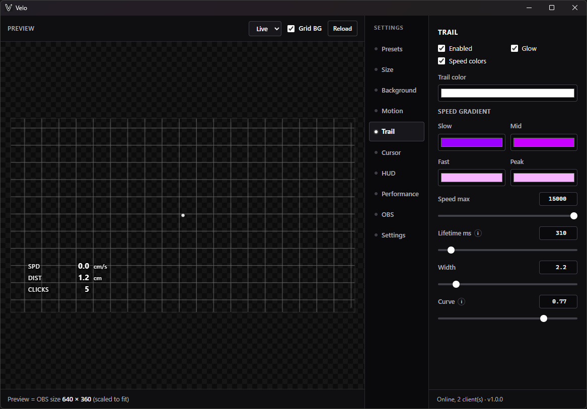
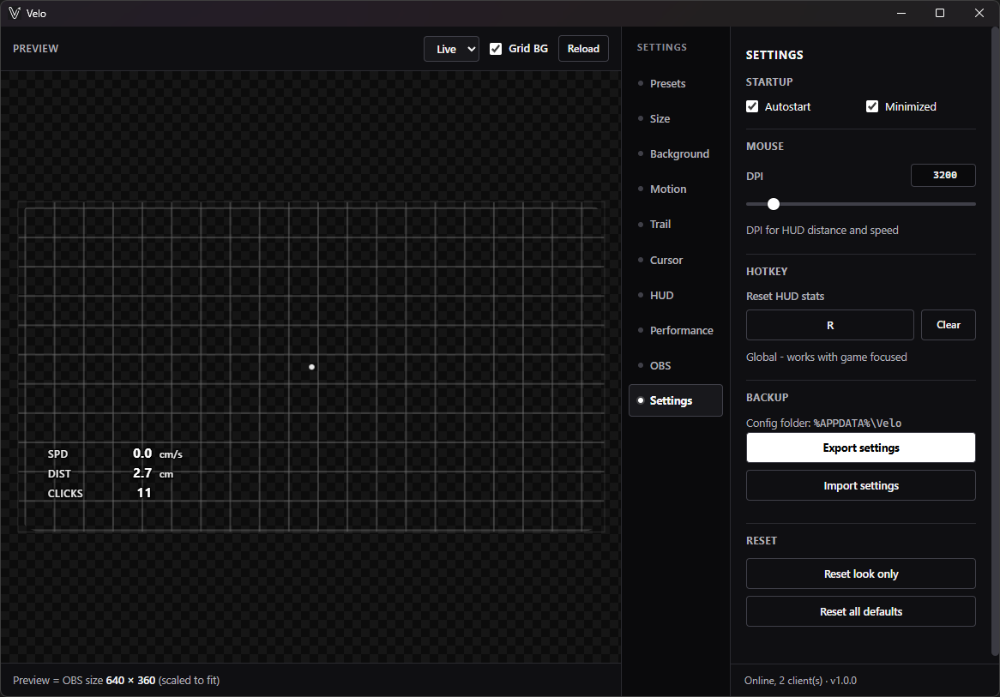
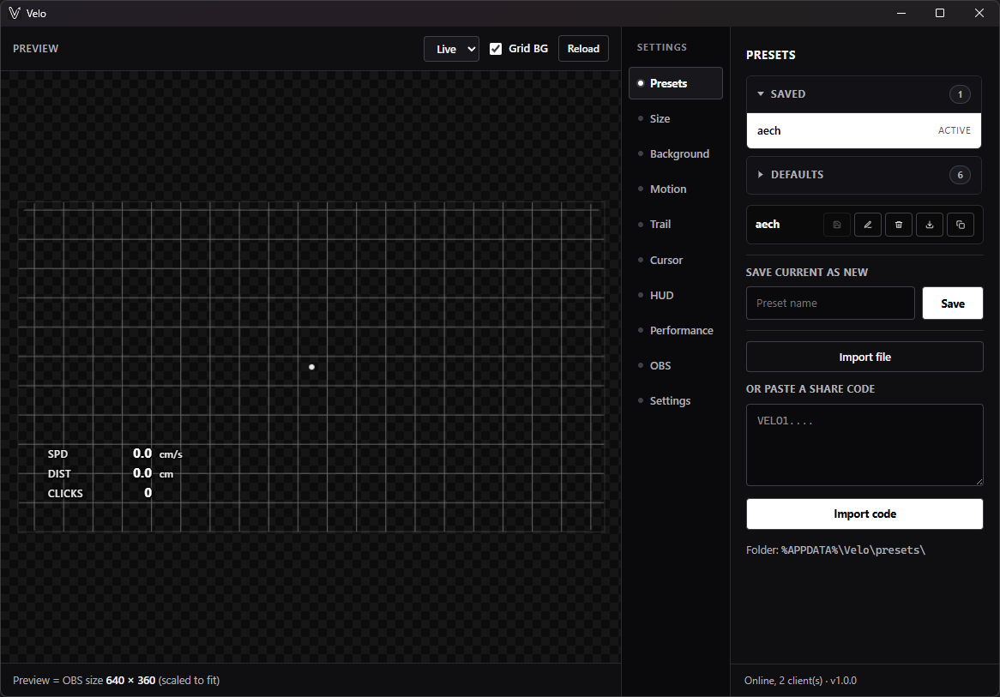
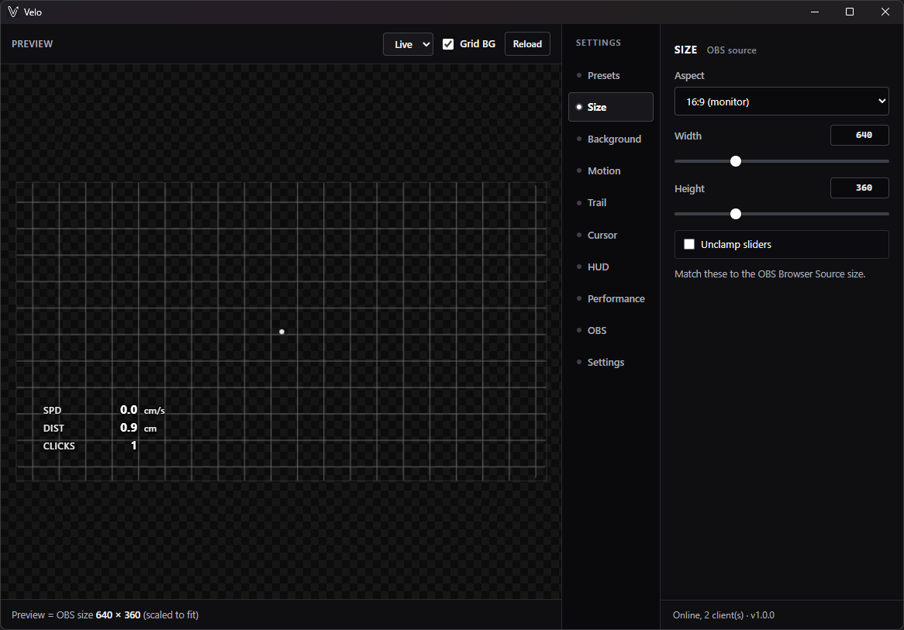
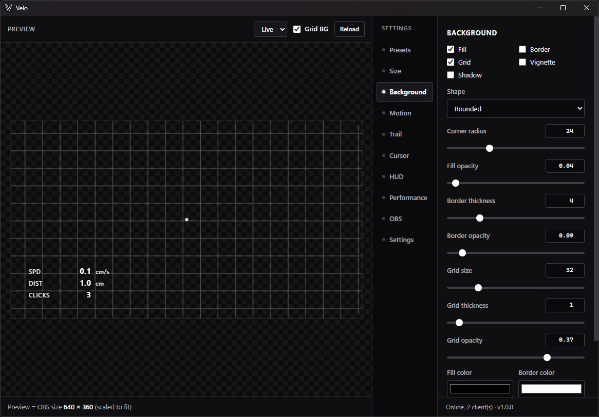
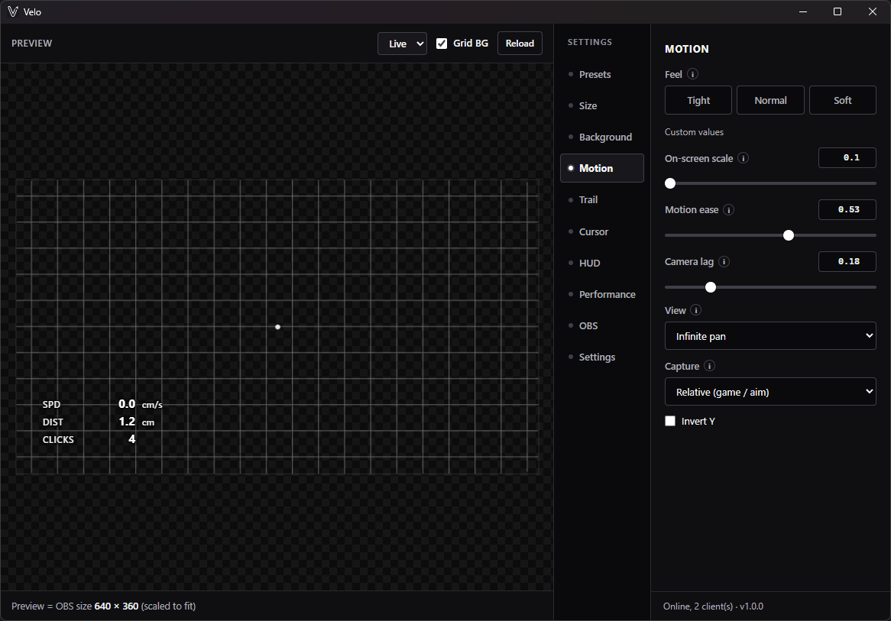
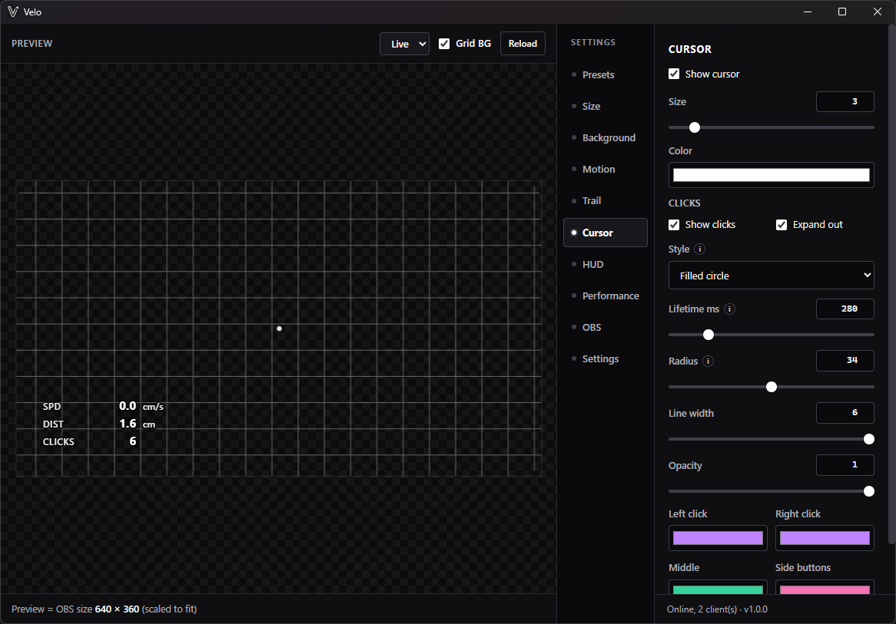
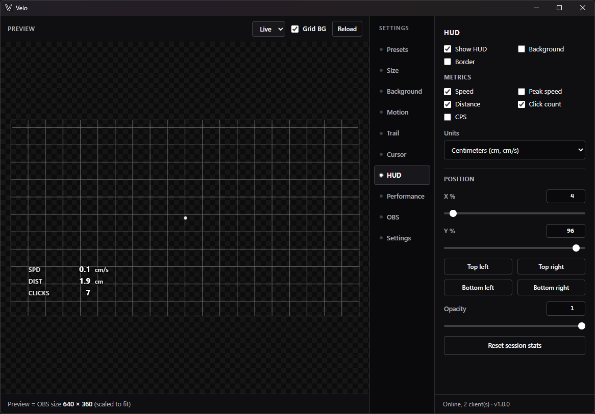
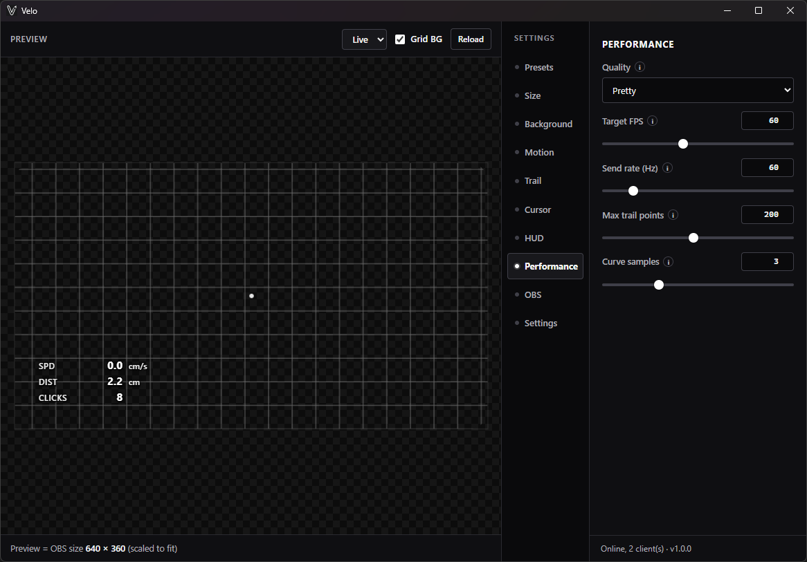
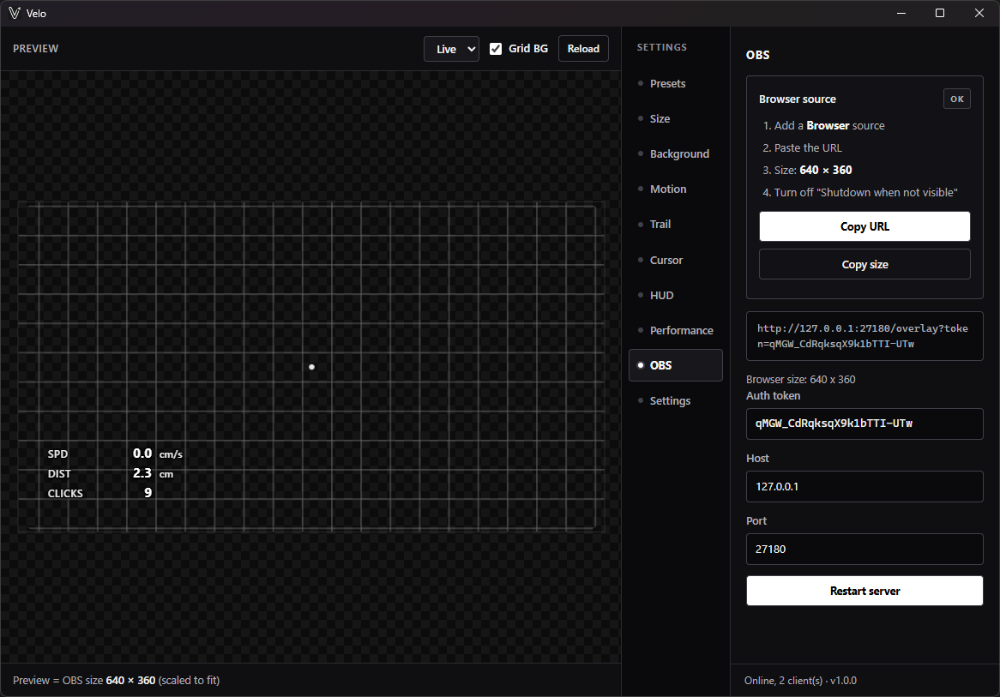

# Velo

Mouse Input overlay for OBS. Made for aim trainers and FPS games.

[](https://github.com/aechXIII/Velo/releases) [](LICENSE) []() [](https://buymeacoffee.com/aechxiii)
---
## Demo




<details>
<summary>More screenshots</summary>



















</details>

---

## Features

- Speed-colored or solid mouse trails (glow, curve, fade)
- Relative capture (raw input) for games and aim trainers
- Absolute capture for desktop cursor
- Motion feel, pad background, size for OBS
- Built-in and saved presets, share codes
- Session HUD: speed, distance, clicks, CPS (DPI-aware)
- Global hotkey to reset HUD stats (works while a game is focused)
- Autostart, backup import/export, tray shortcuts

---

## My preset
Open **Presets**, paste the code below, click **Import code**.
```
VELO1.eNp1lVGT4iAMgP8L--o4tVZ39Yfcy80NgyVtGSn0gLq6O_vfL6GCrbvnk_kSkhCS9JOJYWBH9gu0ZSsWbgOgNDjwEFC-gPPKGkSbdbEukBjRk4WAukPprIxEafTgUMIzQZnWs-Mnq8UQRge8t5LsHWgR1AXQShn0GviNHRuhPdAx4xUqVUCGcTCsgvd0UplGGRXoZI2xneBatOxYrDdvD2LtmYsOhCQFOuhtwLS5r4WGaJsRCB_JbptRA6AxUD36YHsqgnAtBN4MeJE9OnNgJDj-dxQ6pkjlCfhnxd49x-Ql7z4my-CE0hyMOGnAVIIbIUGtGgiqx4Kg1-0mG_fiygerTEBcFhm_Kxk6JOsykVbb96VLIvykR4dVy2a9MlwqH4Spp3smhe-tDR0-D9LE6tFdotXrazYT_aCBclyxRkjgPtyohmw6z_JRqy0GZi9N_NHrDwCS4lMt6BHuQFwxv11RZIJlptL-_mQh5pJdHQ5Fga6-VpNmvd3NlPXbUrmfK5v9aftQbn7Q_EnRo0Z9QKql77CKWAhvHZc2JPwg3Efr7YJ9v_5MaQdRx04p1ocUQKv67LNzkpYtUb4ViTsh1UgvUD0sDaSW2CeYo2wSgesgjFwGSc_XKK1ZgjH7OKYamhCrW7xVTY0GTrXdkvRKyujiZVvJ7eGA6LqJV69ey9OexDKKp1NTVvgGbBDyeQgI-U7E7eLsiAMl2UTjtfhQ07tRjxDrgLJ4gtdJ3t3F21JMRSurST61P6WANL9cEX8sK2avViQncbjuayoC62gVZM_fVd8bY6achzgsNPfHrXKlJE37zP2E5h6q3aRpnVrckeTUs-UM4fDXZwPex47J-OeEo2oWbPs68dpZj6moZVky_Y-3h37mclM-K6ekaa8Tv6jW4J6FRaQEF7ndC4G9PfC4nfIICHMRngucfOoVttkfDyzjNFBVkdHUeFg42ubejq6GRSelL1bWfO-mh27-2itm8aunxW02tnFH0nLAbR3ybojCYrgncmof4ScQO-cJ3oekSvJ9Sg77BKaAtAmXASMfQJyfHE7bi_b1D3ix1GaKxwdorhrxM-7pQ9uzr69_dmLfaQ==
```

---

## Install

1. Download the setup from [Releases](https://github.com/aechXIII/Velo/releases)
2. Run it (no admin)
3. App installs to `%LOCALAPPDATA%\Velo`

Config and presets live in `%APPDATA%\Velo` and stay across updates.

Needs Windows 10 or 11 (64-bit) and [WebView2](https://developer.microsoft.com/en-us/microsoft-edge/webview2/) (already on Windows 11).

---

## OBS setup

1. Start Velo
2. Settings → OBS → Copy URL
3. In OBS: Sources → Browser, paste the URL
4. Set width/height to match Size in Velo (or Copy size)
5. Uncheck "Shutdown source when not visible"
6. Leave the browser source background transparent

Common sizes: 480x480 or 640x360 for a corner pad, 1920x1080 for full canvas.

While streaming or recording set the settings preview to Off or Lite if you care about CPU usage.

---

## Config paths

| | |
|---|---|
| Config | `%APPDATA%\Velo\config.json` |
| Presets | `%APPDATA%\Velo\presets\` |

Startup, DPI, HUD hotkey, and full backup are under the Settings tab.

---

## Build from source

```powershell
./scripts/setup.ps1
./scripts/run.ps1
```

```powershell
./scripts/build.ps1 -Clean
./scripts/build.ps1 -Clean -Installer
```

Installer build needs [Inno Setup 6](https://jrsoftware.org/isdl.php). Output goes to `dist\Velo.exe` and `installer\Output\Velo-Setup-*.exe`.

---

## Credits

Inspired by [input-overlay](https://github.com/girlglock/input-overlay).

## License

MIT. See [LICENSE](LICENSE).
