# Velo

Mouse Input overlay for OBS. Made for aim trainers and FPS games.

[](https://github.com/aechXIII/Velo/releases) [](LICENSE) []() [](https://buymeacoffee.com/aechxiii)

---

## Demo

| | |
|---|---|
|  | 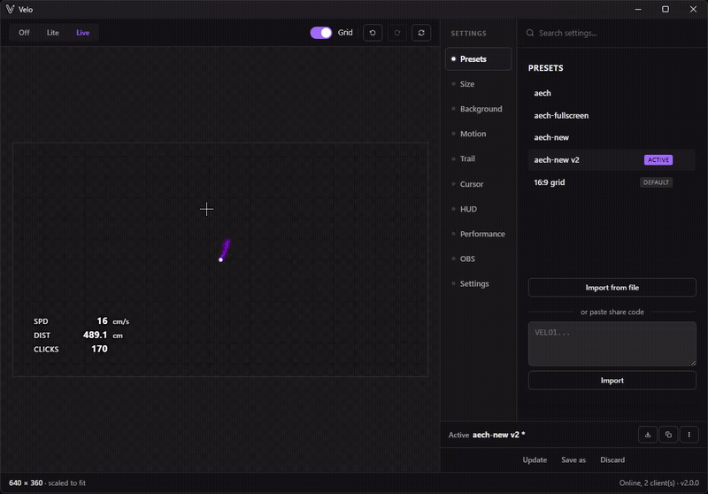 |

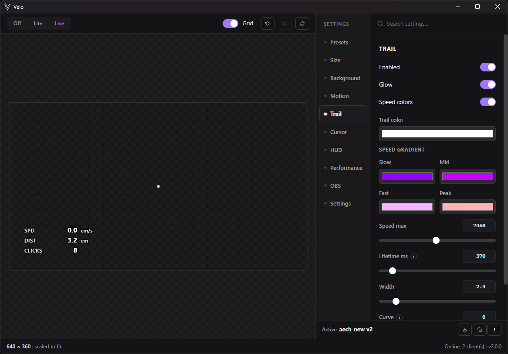

<details>
<summary>More screenshots</summary>

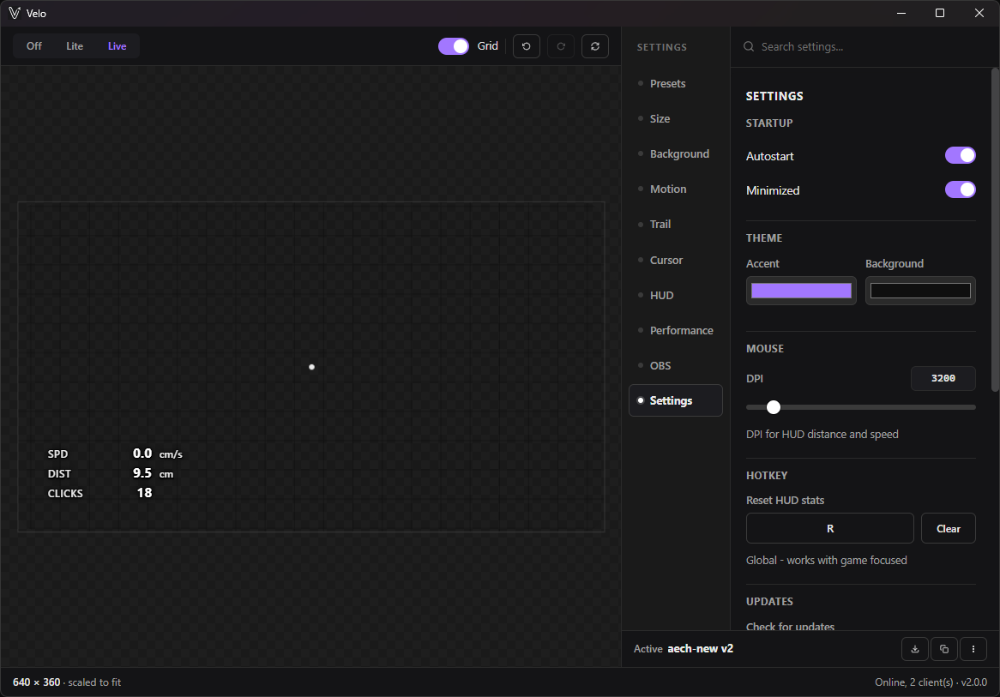

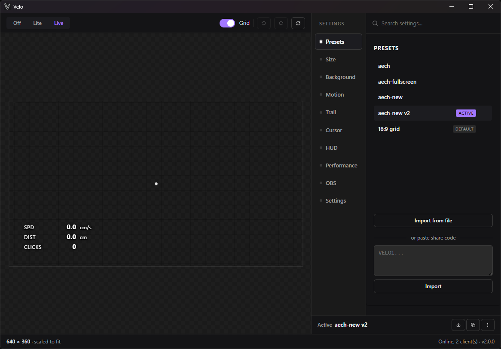

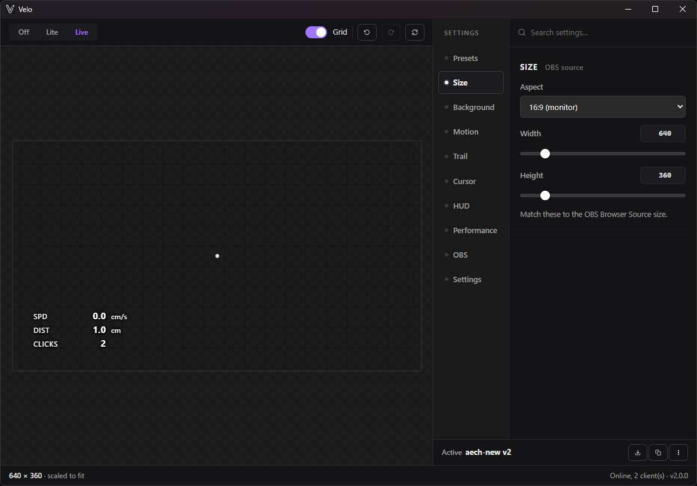

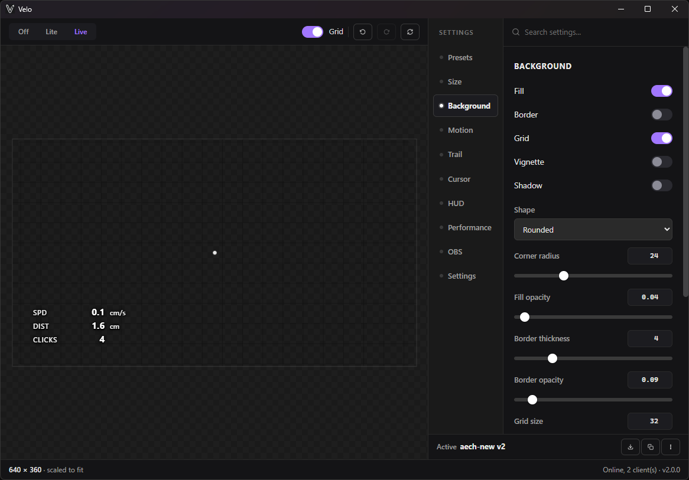

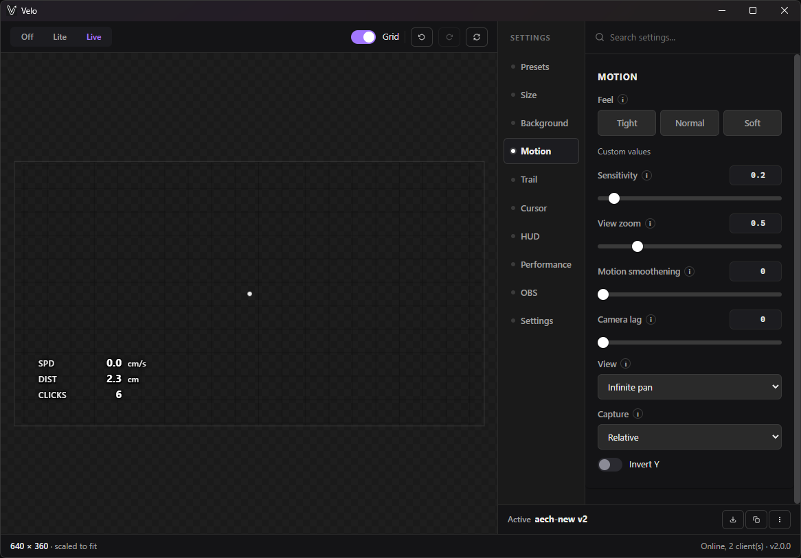


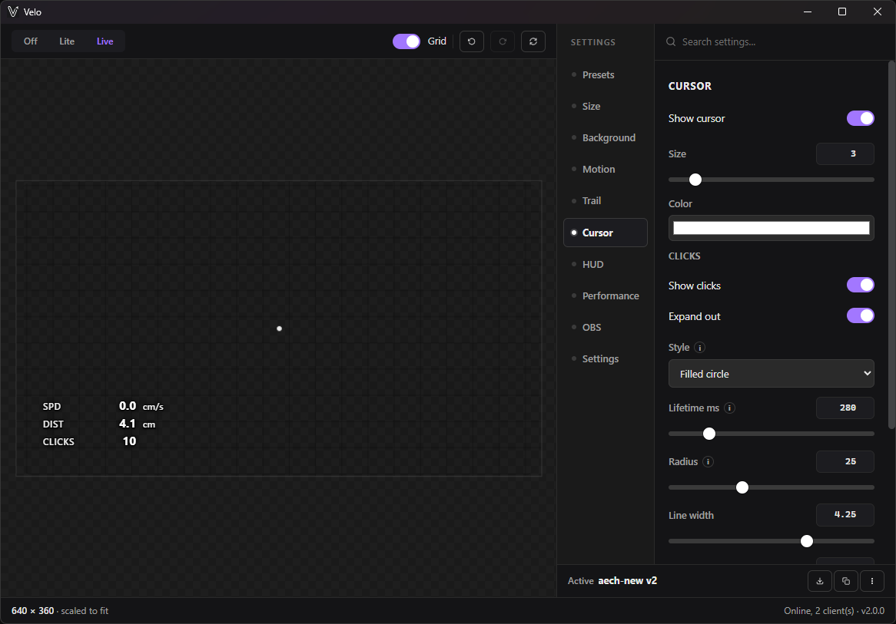

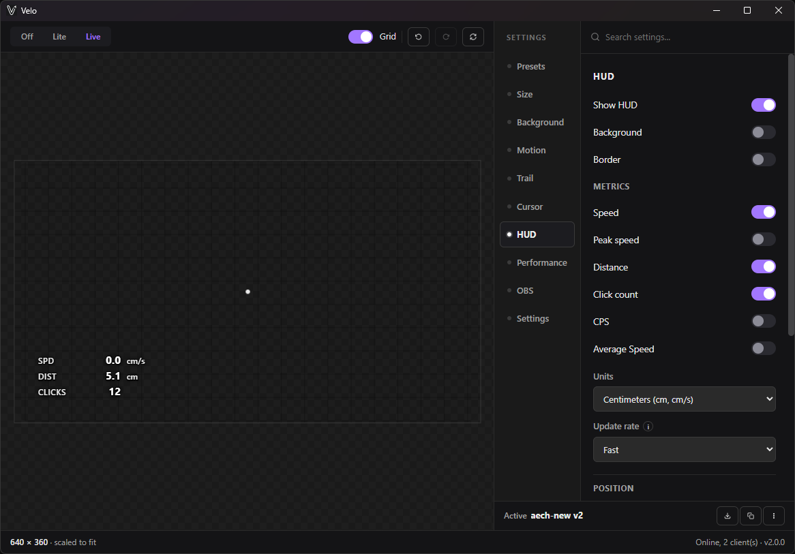

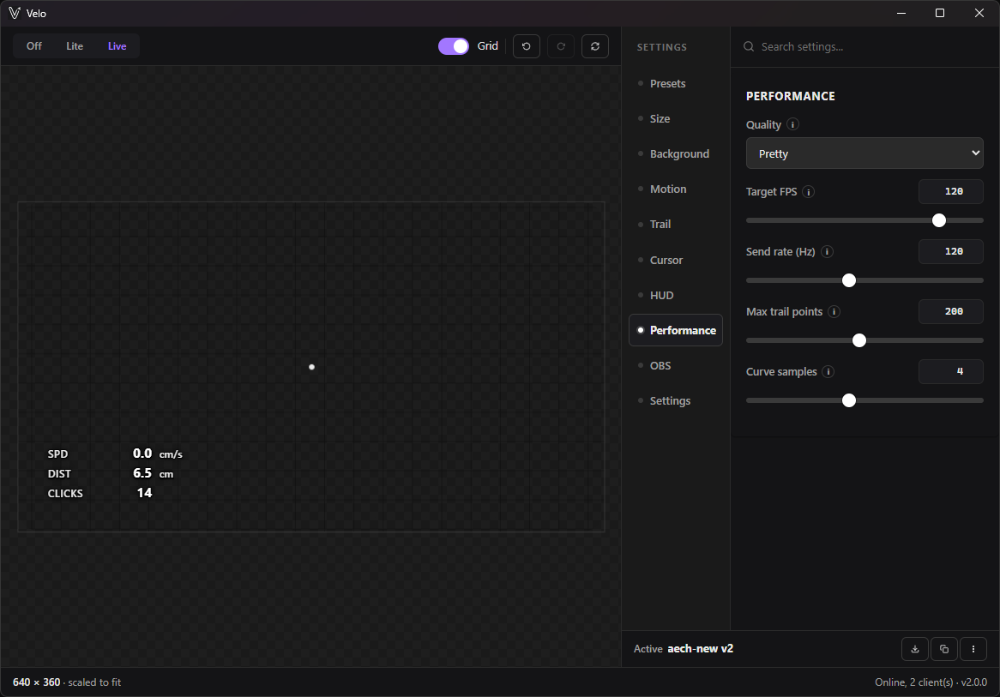

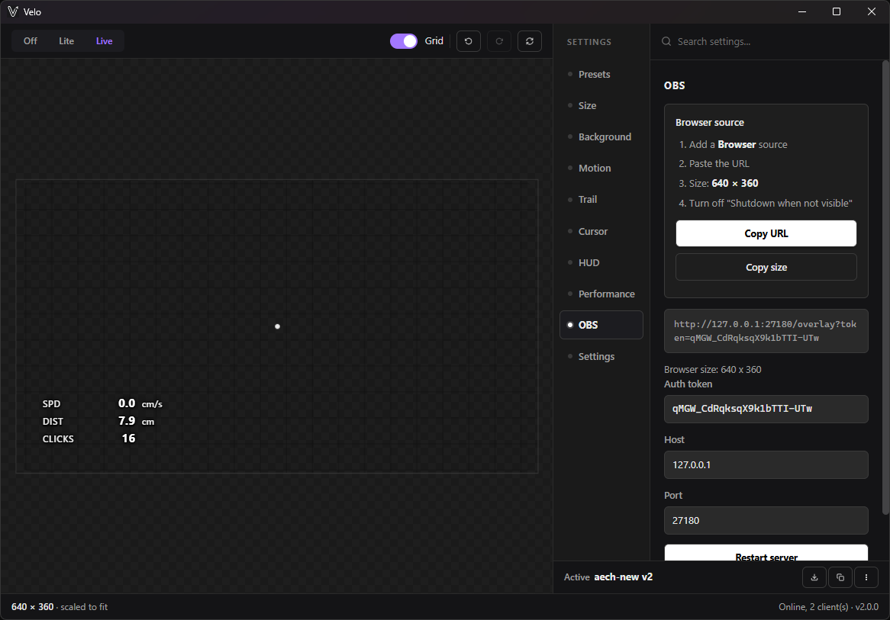

</details>

---

## Features

**Overlay**
- Speed-colored or solid mouse trails with glow, curve smoothing, and fade modes
- Configurable background (fill, border, grid, vignette, shadow)
- Per-button click indicators (ring, fill, double, cross)
- Cursor dot with show/hide and expand-on-click
- Full Canvas rendering with live preview in settings

**Presets**
- 6 built-in presets (removable)
- Save, rename, duplicate, and delete your own presets
- Share codes to send presets to anyone
- Import from file or paste a code

**HUD**
- Real-time speed, peak speed, distance, clicks, and CPS
- DPI-aware metric
- Configurable update rate

**Motion**
- Three feel presets (Tight, Normal, Soft) plus custom sliders
- Sensitivity and view zoom controls
- Camera lag, look-ahead, and follow
- Infinite pan or fixed pad view modes

**Settings UI**
- Search bar to instantly find any setting
- Undo/redo for config changes
- Customizable accent color and background color
- Onboarding wizard for first-time setup

**System**
- Low-level Raw Input capture for games
- System tray with quick actions
- In-app update checker with one-click install
- Autostart with Windows, start minimized
- Single instance—launching again opens the settings window
- Diagnostics and rotating logs for support

---

## Install

1. Download the setup from [Releases](https://github.com/aechXIII/Velo/releases)
2. Run it (no admin needed)
3. Installs to `%LOCALAPPDATA%\Velo`

Config and presets are in `%APPDATA%\Velo`.

Requires Windows 10 or 11 (64-bit) and [WebView2](https://developer.microsoft.com/en-us/microsoft-edge/webview2/). The installer sets up WebView2 when it is missing. The portable build shows a download link instead.

Direct downloads update through Velo and support Windows autostart. When Velo is launched through the itch app, itch manages updates and autostart is unavailable.

---

## OBS setup

1. Start Velo
2. Open Settings → OBS and copy the URL
3. In OBS: add a Browser source and paste the URL
4. Set the browser width/height to match what you have under Size
5. Uncheck "Shutdown source when not visible"
6. Leave the background transparent

Common sizes: 480×480 or 640×360 for a corner pad.

Set the settings preview to Off or Auto while streaming or recording if you want to save CPU.

---

## Config paths

| | |
|---|---|
| Config | `%APPDATA%\Velo\config.json` |
| Presets | `%APPDATA%\Velo\presets\` |
| Managed images | `%APPDATA%\Velo\assets\` |
| Backups | `%APPDATA%\Velo\backups\` |
| Logs | `%APPDATA%\Velo\logs\` |

Broken configs are moved to `%APPDATA%\Velo\recovery\` before Velo restores a backup or loads safe defaults.

## Privacy and support

Velo has no analytics, telemetry, ads, or automatic crash reporting. It runs a local server for OBS and checks GitHub for updates in standard builds. See [PRIVACY.md](PRIVACY.md) for details.

Settings → About & Support can copy diagnostics, open the log and config folders, or report a bug. Diagnostics and normal settings exports leave out connection credentials. Full backups include them and should stay private.

---

## Build from source

```powershell
.\scripts\setup.ps1
.\scripts\run.ps1
```

```powershell
.\scripts\build.ps1 -Clean
.\scripts\build.ps1 -Clean -Installer
.\scripts\build.ps1 -Clean -Itch
```

Installer builds need [Inno Setup 6](https://jrsoftware.org/isdl.php). Output goes to `dist\Velo\`, `dist\Velo-itch\`, or `installer\Output\Velo-Setup-*.exe`.

---

## Credits

Inspired by [input-overlay](https://github.com/girlglock/input-overlay).

## License

GNU GPL v3 or later. See [LICENSE](LICENSE) and [THIRD_PARTY_NOTICES.md](THIRD_PARTY_NOTICES.md).

The GPL covers Velo's source code. It does not grant permission to use the Velo name or logo for modified or unofficial distributions.
